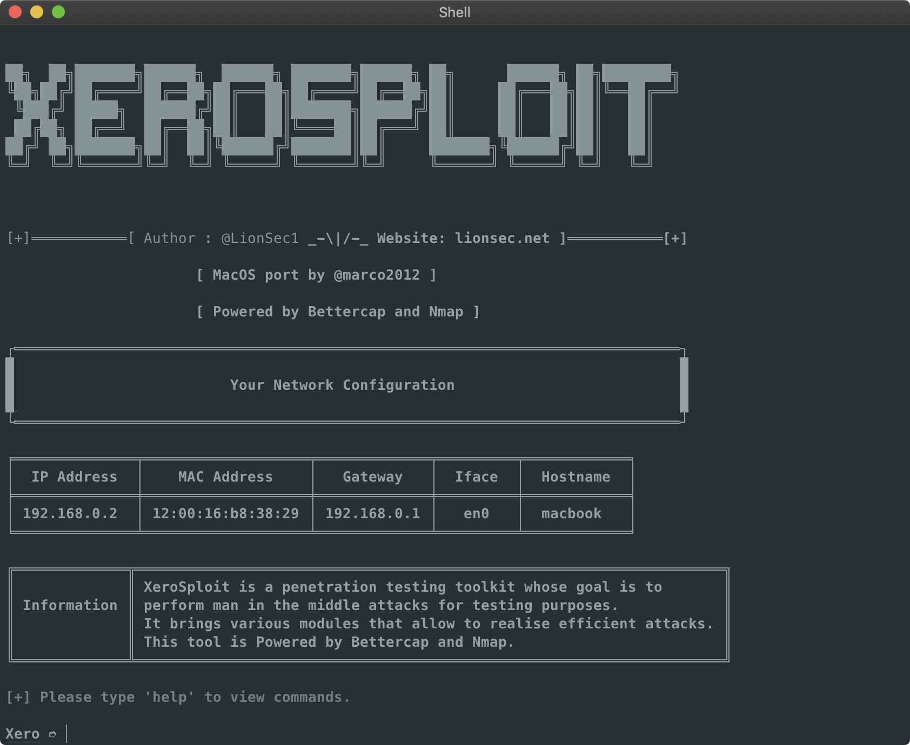

[]()
[]()
[]()
[]()

Xerosploit for MacOS
=

This is a port for MacOS of the original [Xerosploit framework](https://github.com/LionSec/xerosploit) by LionSec.

Xerosploit is a penetration testing toolkit whose goal is to perform man in the middle attacks for testing purposes. It brings various modules that allow to realise efficient attacks, and also allows to carry out denial of service attacks and port scanning.
Powered by <a href="https://www.bettercap.org"> bettercap</a> and <a href="https://www.bettercap.org"> nmap</a>.

<p align="center">
  
</p>

Dependencies
=

- [Bettercap](<https://www.bettercap.org/>)
- [Nmap](https://nmap.org/)
- [iproute2mac](https://github.com/brona/iproute2mac)

```
brew install iproute2mac nmap bettercap
```

Installation
=
[Homebrew](https://brew.sh/) must be already installed. Dependencies will be automatically installed.

    git clone https://github.com/marco2012/xerosploit
    cd xerosploit && python install.py
    xerosploit

Tested on MacOS 10.14 Mojave.

Features 
=

- Port scanning
- Network mapping
- Dos attack
- Html code injection
- Javascript code injection
- Download intercaption and replacement
- Sniffing
- Dns spoofing
- Background audio reproduction
- Images replacement
- Drifnet
- Webpage defacement

Demonstration
=
https://www.youtube.com/watch?v=35QUrtZEV9U
